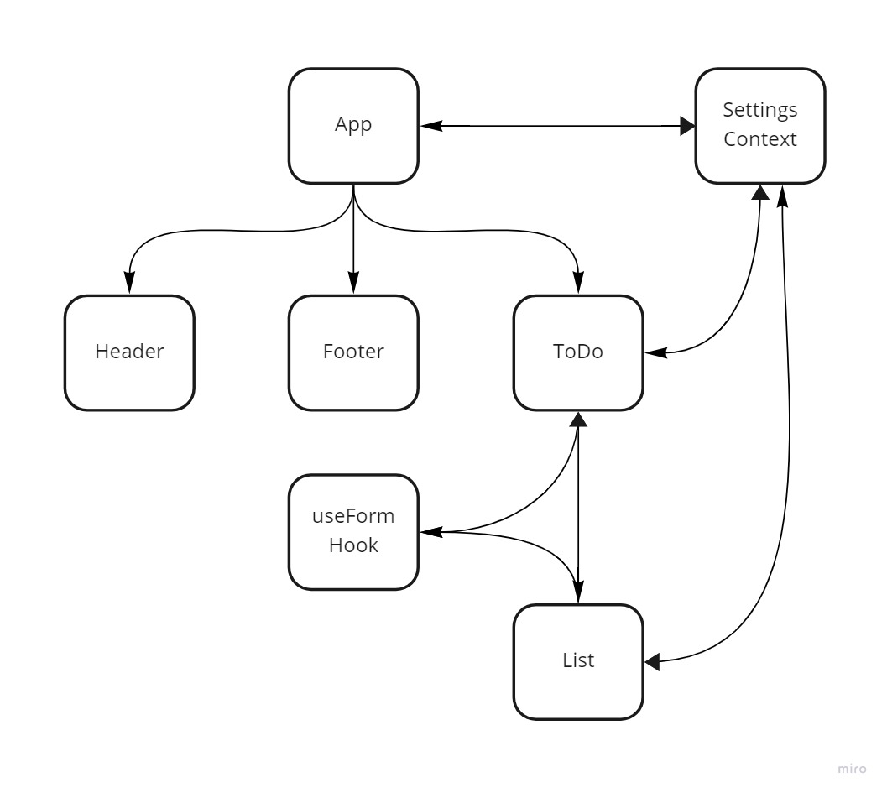
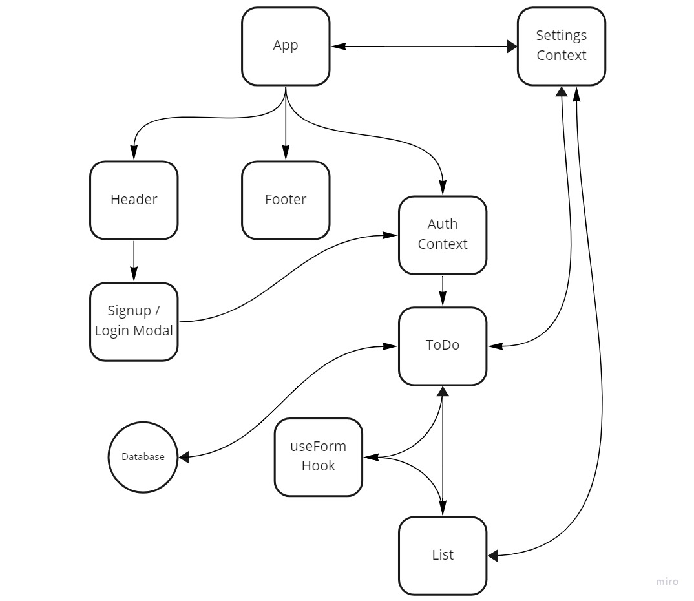

# todo-app

A Web Application for securely managing a To Do List

## Phase 1 & 2

### Submission Links

- [PR Link](https://github.com/karamalqinneh/todo-app/pull/2)
- [Deployed Version](https://todo-app-karam.netlify.app/)

### UML Diagram & Consumption of the Global State

## Phase 3 & 4

### Submission Links

- [PR Link](https://github.com/karamalqinneh/todo-app/pull/3)
- [Deployed Version](https://todo-app-karam.netlify.app/)

### UML Diagram & Consumption of the Global State

